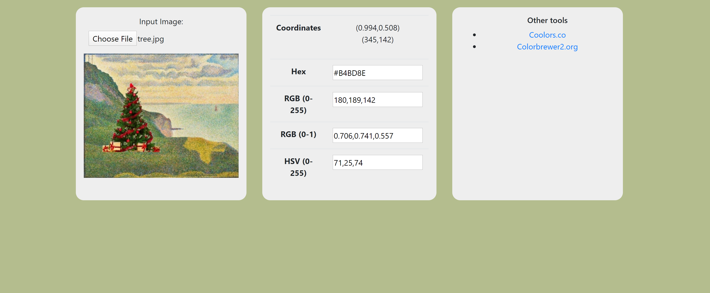

# html-color-picker
HTML Color Picker

A small website to convert between color coordinates
* HEX
* RGB (0-255)
* RGB (0-1)
* LAB

Relies on color-convert

Try it at https://davidl.me/apps/colors

## Screenshots

## Setup for development
* `git clone`
* `npm run setup` will install dependencies.
* `npm run dev` will start a server at `localhost:8080` with hot reloading.

## Features
* Sample colors from images
* Color picker

<!-- ## TODO
* Add locking on click to image sampling
 * With multiple sampling points
* Ability to save colors (to local storage on browser)
 * Export colors to csv
* Ability to generate color palettes (similar to coolors)
 * Save and export as csv
* Ability to create and edit colormaps -->
